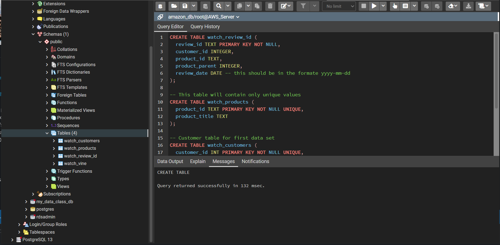
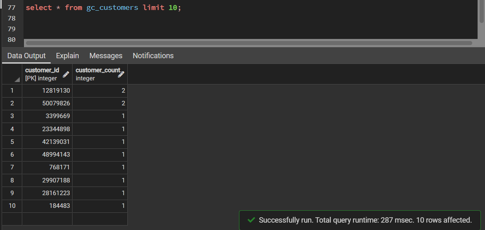

# big-data-challenge

CWRU Bootcamp Big Data Homework

Pyspark query 1 & 2 created for amazon watches  and GC reviews in google collabratory.  See Notebooks.

AWS DB Created

SQL queries used to create tables:

SQL Queries showing watch data landed in database:

Gift Card Tables Created:

SQL Queries showing GC data landed in database:

